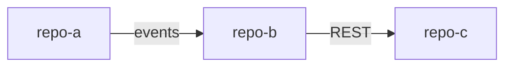

# SYSTEM-MAP — [system name]
**Repos:** [repo-a] · [repo-b] · [repo-c] · [repo-d] · [repo-e]

## Edges (no edge without a code anchor)
| From | To | Mechanism | Contract (one sentence) | Code anchor | Mapped |
|---|---|---|---|---|---|
| [chatbot] | [topology-svc] | [REST] | [reads node/link snapshots for tool answers] | [TopologyClient.java] | 2026-07 |
| [topology-svc] | [chatbot] | [events] | [publishes LinkDeleted; trigger engine subscribes] | [LinkEventListener.java] | 2026-07 |

## Shared infrastructure
- [DB/schemas shared by more than one repo — the most dangerous edges]
- [common libraries and who owns them]

## ⚠ Suspected edges (not yet anchored)
- [from → to, why suspected, how to verify]
